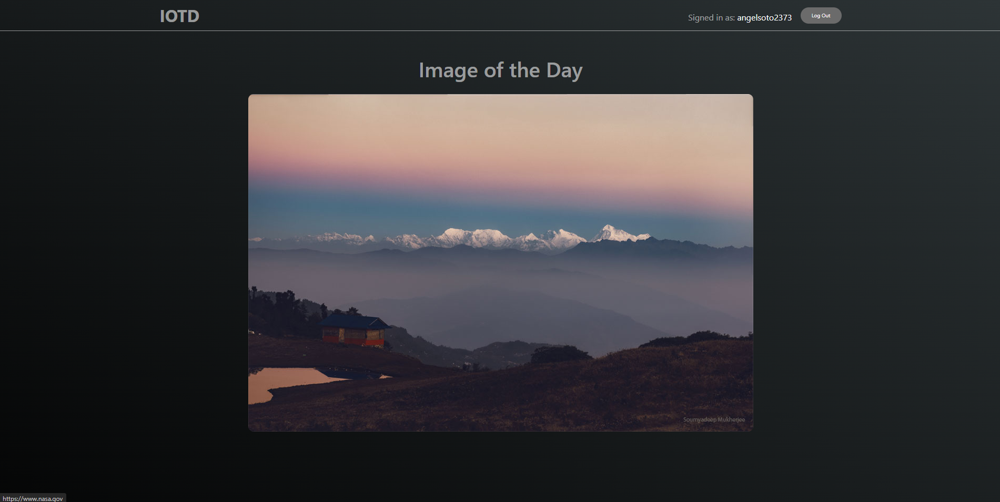
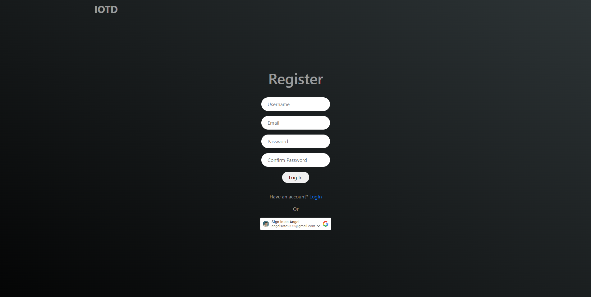

# Image Of The Day (IOTD)

IOTD is a Single Page Application (SPA) that serves as an image gallery, fetching data from NASA to display a new image every day. It incorporates various technologies to fulfill the requirements outlined in the prompt:

- ReactJS
- ExpressJS & NodeJS
- MongoDB
- Vercel
- Google OAuth

Overall, this app demonstrates my ability to create a dynamic SPA that retrieves data from an external API, persist user credentials in a MongoDB database, handle server communication using Express.js and Node.js, deploy the application using Vercel, and integrate Google OAuth for user authentication and registration.

Access the app through the links below:

[client](https://image-of-the-day-client.vercel.app/)

[server](https://image-of-the-day.vercel.app/)

